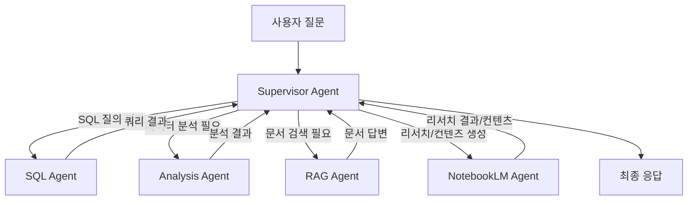

# 📐 워크스페이스 구조 재편 계획

> **작성일**: 2026-03-04
> **목적**: 데이터 수집·관리 프로젝트를 AI 에이전트 + 웹 서비스 통합 플랫폼으로 확장

---

## 1. 워크스페이스 폴더명 변경

| 항목 | 변경 전 | 변경 후 |
|:---:|---|---|
| **폴더명** | `00_APT_Data_Collection_Manipulation` | `apt-insight-platform` |
| **전체 경로** | `d:\Work\00_APT_Data_Collection_Manipulation` | `d:\Work\apt-insight-platform` |

> [!IMPORTANT]
> 폴더명 변경 시 GitHub 원격 저장소와의 연결(remote URL), Dokploy 설정이 모두 영향을 받습니다.
> **GitHub 저장소명은 Settings에서 별도로 변경**하고, Dokploy에서도 Repository 경로를 업데이트해야 합니다.

---

## 2. 최종 폴더 구조

```text
d:\Work\apt-insight-platform\
│
├── 📁 pipeline/                     # 데이터 수집·가공·적재 파이프라인
│   ├── collect_and_process.py         # 공공데이터 실거래가 수집 + 가공
│   ├── collect_naver_listing.py       # 네이버 부동산 매물 수집
│   ├── update_and_migrate.py          # 증분 수집 + DB 마이그레이션
│   ├── load_naver_csv.py              # CSV → DB 수동 적재
│   └── utils.py                       # 파이프라인 전용 유틸리티
│
├── 📁 agent/                        # 멀티 에이전트 시스템 (LangGraph v1 기반)
│   ├── __init__.py
│   ├── graph.py                       # 메인 그래프 (Supervisor 패턴 오케스트레이션)
│   ├── state.py                       # 공유 상태(State) 스키마 정의
│   ├── agents/                        # 개별 서브 에이전트 모음
│   │   ├── __init__.py
│   │   ├── sql_agent.py                 # Text-to-SQL 에이전트
│   │   ├── analysis_agent.py            # 데이터 분석/인사이트 에이전트
│   │   ├── rag_agent.py                 # RAG 에이전트 (문서 기반 Q&A)
│   │   └── notebooklm_agent.py          # NotebookLM 에이전트 (리서치·컨텐츠 생성)
│   ├── tools/                         # 에이전트 도구(Tool) 모음
│   │   ├── __init__.py
│   │   ├── sql_tools.py                 # DB 스키마 조회, SQL 실행, 쿼리 검증
│   │   ├── search_tools.py              # 웹 검색, 문서 검색
│   │   ├── chart_tools.py               # 시각화 도구 (차트 생성 등)
│   │   └── notebooklm_tools.py          # NotebookLM MCP 클라이언트 도구
│   ├── prompts/                       # 시스템 프롬프트·Few-shot 예시
│   │   ├── supervisor.py                # Supervisor 프롬프트
│   │   ├── sql_prompt.py                # SQL 에이전트 전용 프롬프트
│   │   ├── analysis_prompt.py           # 분석 에이전트 전용 프롬프트
│   │   └── notebooklm_prompt.py         # NotebookLM 에이전트 전용 프롬프트
│   └── config.py                      # 에이전트 설정 (모델명, 파라미터)
│
├── 📁 webapp/                       # 웹 애플리케이션 (API + 프론트엔드)
│   ├── app.py                         # FastAPI 메인 서버
│   ├── routes/                        # API 라우트 모음
│   │   ├── __init__.py
│   │   ├── chat.py                      # 채팅(자연어→SQL) API
│   │   └── data.py                      # 데이터 직접 조회 API
│   ├── static/                        # 정적 파일 (CSS, JS, 이미지)
│   ├── templates/                     # HTML 템플릿 (Jinja2)
│   └── Dockerfile                     # 웹앱 전용 Docker 빌드 설정
│
├── 📁 shared/                       # 전 모듈 공통 코드
│   ├── __init__.py
│   ├── db_engine.py                   # DB 엔진 팩토리 (get_db_engine)
│   └── config.py                      # 환경변수 로드 (.env 파싱)
│
├── 📁 docs/                         # 프로젝트 문서
├── 📁 .agents/                      # AI 코딩 어시스턴트용 설정
│   ├── rules/                         # 코드 규칙
│   ├── workflows/                     # 자동화 워크플로우
│   └── skills/                        # 개발 가이드라인 (SKILL 파일)
│       ├── langgraph-agent.md           # LangGraph v1 멀티에이전트 개발 가이드
│       └── webapp-dev.md                # 웹앱 개발 가이드
│
├── 📁 datas/                        # 수집 데이터 (.gitignore 대상)
├── .env
├── pyproject.toml
├── langgraph.json                   # LangGraph 서버 설정 (선택)
└── README.md
```

---

## 3. 멀티 에이전트 아키텍처 (LangGraph v1 Supervisor 패턴)



### 서브 에이전트 역할

| 에이전트 | 역할 | 주요 도구 |
|---|---|---|
| **SQL Agent** | 자연어 → SQL 변환, 쿼리 실행, 결과 해석 | `list_tables`, `get_schema`, `execute_query`, `check_query` |
| **Analysis Agent** | 조회된 데이터 기반 통계·비교분석·트렌드 해석 | `calculate_stats`, `generate_chart` |
| **RAG Agent** | 부동산 용어·정책·가이드 문서 기반 Q&A | `search_docs`, `retrieve_context` |
| **NotebookLM Agent** | 리서치 노트북 생성, 소스 큐레이션, AI 분석·요약, 팟캐스트/브리핑 문서 생성 | `notebook_list`, `notebook_create`, `source_add`, `chat_query`, `audio_create` |

> [!NOTE]
> NotebookLM Agent는 [notebooklm-mcp-cli](https://github.com/jacob-bd/notebooklm-mcp-cli)의 MCP 서버를 통해 연동됩니다.
> 별도 설치 필요: `uv tool install notebooklm-mcp-cli` + `nlm auth login`

---

## 4. 마이그레이션 실행 순서 및 진행 상태

| 단계 | 작업 | 상태 |
|:---:|---|:---:|
| **1** | 폴더 구조 생성 (`shared/`, `agent/`, `webapp/`, `.agents/skills/`) | ✅ 완료 |
| **2** | `shared/` 공통 모듈 생성 (db_engine.py, config.py) | ✅ 완료 |
| **3** | `agent/` 뼈대 파일 생성 (config.py, state.py, __init__.py 등) | ✅ 완료 |
| **4** | `webapp/` 뼈대 파일 생성 (FastAPI app.py) | ✅ 완료 |
| **5** | `.agents/skills/` SKILL 가이드라인 생성 | ✅ 완료 |
| **6** | 기존 스크립트 `pipeline/`로 이동 + import 경로 수정 | ⏳ 미진행 |
| **7** | `pyproject.toml` 의존성 그룹 분리 | ⏳ 미진행 |
| **8** | 로컬 폴더명 변경 (`apt-insight-platform`) | ⏳ 미진행 |
| **9** | GitHub 저장소명 변경 + Dokploy 경로 업데이트 | ⏳ 미진행 |

> [!WARNING]
> 단계 6~9는 기존 Dokploy 스케줄러·배포 경로에 영향을 줍니다.
> 서버 배포 중단 없이 진행하려면 **서버측 작업 일시 중지 후** 일괄 전환해야 합니다.
